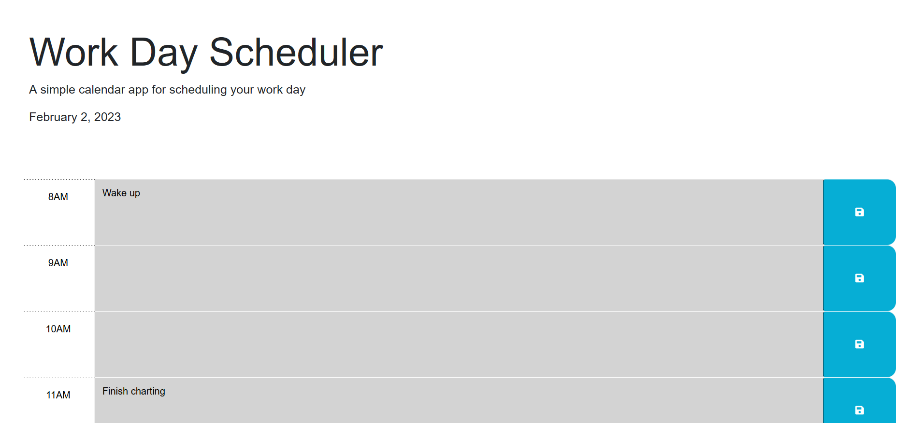

# Work Day Scheduler

## Description

This a website allows to plan your schedule for the day and save events.

## Installation

N/A

## Usage
Click on the text box for each time block and type an event you would like to schedule for that time. Click the save button to save that event for that time block. If you exit the page, the events previously inputted will show up when you return. The time blocks are color coded based on whether the specified time has happened, is happening, or has not happened yet.

## Link to deployed Application
https://etfruitninja.github.io/work-day-scheduler/

## Screenshot

## Credits

The creation of this website was guided by the UW Coding Bootcamp.

## License

N/A